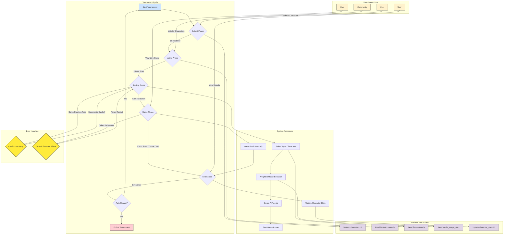
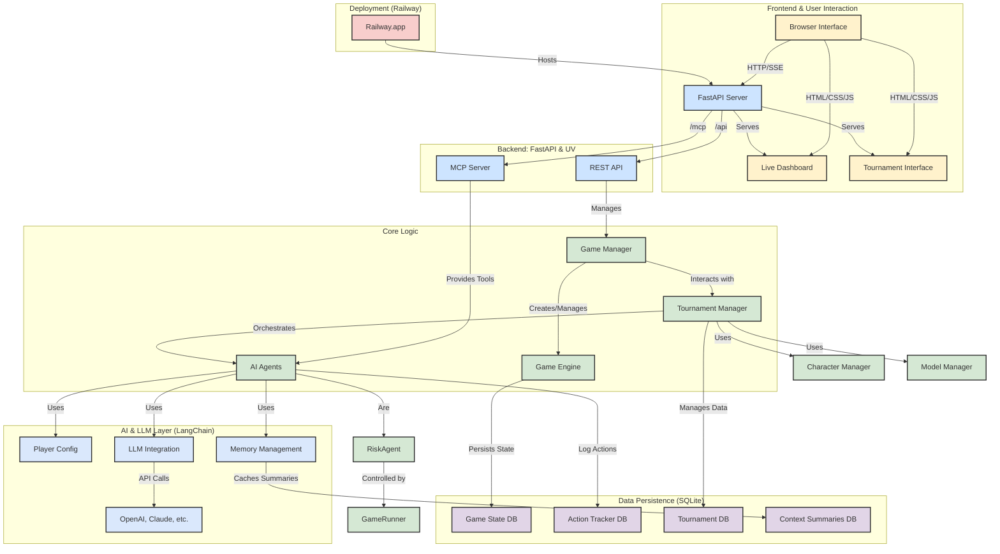

# Risk MCP - AI Agents Playing Risk

A sophisticated Risk board game implementation featuring AI agents with intelligent memory management, context summarization, MCP (Model Context Protocol) integration, and real-time dashboard monitoring. Built with Python, FastAPI, and UV for modern dependency management.

## ✨ Key Features

- 🧠 **Intelligent Memory Management** - Context summarization prevents memory overload
- 🤖 **Advanced AI Agents** - Strategic decision-making with persistent memory
- 🏆 **Tournament Mode** - Hosted tournaments with character submission and voting
- 📊 **Comprehensive Tracking** - SQLite database logs all decisions and strategies
- 🔄 **Context Optimization** - Automatic summarization when context gets too large
- 🌐 **Real-time Dashboard** - Live monitoring of agent decisions and game state
- 🚂 **Railway Ready** - Production deployment with Python buildpacks
- ⚡ **Modern Stack** - UV package management, FastAPI, LangChain

## 🚀 Quick Start

### One-Command Demo
```bash
python start_demo.py
```

This script automatically:
- ✅ Checks prerequisites (UV)
- 🚂 Starts the Risk server on Railway
- 🤖 Launches AI agents playing automatically
- 🌐 Opens the dashboard in your browser
- 📊 Provides real-time game monitoring

### Manual Setup with UV

#### Prerequisites
- Python 3.11+
- [UV](https://docs.astral.sh/uv/) (Python package manager)

#### Installation
```bash
# Install UV if not already installed
curl -LsSf https://astral.sh/uv/install.sh | sh

# Clone and setup project
git clone <repository-url>
cd risk_mcp

# Install dependencies and create virtual environment
uv sync

# Activate the environment
source .venv/bin/activate  # Linux/macOS
# or
.venv\Scripts\activate     # Windows
```

#### Development Server
```bash
# Start the unified API+MCP server
uv run src/api_server.py

# Or run agents playing automatically
uv run agents/simple_runner.py
```

## 🏗️ Architecture

### Core Components

- **Game Engine** (`src/game/`) - Complete Risk game implementation
- **API Server** (`src/api_server.py`) - FastAPI REST API + MCP server
- **AI Agents** (`agents/`) - Autonomous players using LangChain
- **Dashboard** (`risk_dashboard.html`) - Real-time web interface
- **Persistence** (`src/persistence/`) - Game state and action tracking

### MCP Integration

The project implements the Model Context Protocol, exposing Risk game actions as tools:

- `place_armies` - Deploy armies on territories
- `attack_territory` - Launch attacks between territories  
- `fortify_position` - Move armies defensively
- `send_message` - Diplomatic communication
- `update_strategies` - AI strategic planning

## 🧠 Intelligent Memory Management

### Short-Term Memory System

The project features an advanced **short-term memory system** built with **LangGraph** and **LangChain** that gives AI agents persistent conversational awareness throughout each game:

#### **🔄 LangGraph-Based Agent State**
- **Persistent Conversations**: Each agent maintains ongoing dialogue per game using LangGraph's StateGraph
- **Fresh Start Per Game**: Conversations initialize clean for each new game, no cross-contamination
- **Agent State Schema**: TypedDict-compatible state management with message handling and context tracking

#### **📖 Game Narrator System**
- **Natural Language Updates**: Converts raw game state changes into conversational narratives
- **Context-Aware Descriptions**: "You gained control of Alaska and 3 armies" vs verbose JSON dumps  
- **Phase-Specific Guidance**: Different narrative styles for reinforcement, attack, and fortify phases
- **Strategic Continuity**: Agents understand consequences of previous actions

#### **🎯 Intelligent Message Trimming**
- **LangChain Integration**: Uses `trim_messages` with Risk-specific policies for optimal memory management
- **Smart Preservation**: Keeps system messages, recent turns, and critical game events
- **Token Optimization**: Prevents context window overflow while maintaining strategic awareness
- **Configurable Policies**: Customizable trimming strategies based on game phase and importance

#### **Memory Architecture**

```python
# Agent State Schema (LangGraph compatible)
class AgentState(TypedDict):
    messages: Annotated[List[BaseMessage], add_messages]
    game_id: str
    agent_name: str
    current_phase: str
    turn_number: int

# Game Narrator converts state to conversation
narrator = GameNarrator()
narrative_update = narrator.create_turn_update(game_state_change)

# Memory Manager handles conversation lifecycle  
memory_manager = AgentMemoryManager()
context = await memory_manager.get_conversation_context(game_id, agent_name)
```

#### **Key Benefits**

- **Strategic Continuity**: Agents remember previous decisions and adapt accordingly
- **Efficient Context**: Narrative updates vs full state regeneration saves 60-80% tokens
- **Better Decision Making**: Conversational awareness improves strategic thinking
- **Natural Flow**: Context builds organically instead of starting fresh each turn
- **Memory Policies**: Risk-specific trimming keeps essential information while managing size

### Legacy Context Summarization System

The project also maintains an advanced context summarization system for backwards compatibility:

- **Automatic Triggering** - Summarization activates when context exceeds token limits
- **Multi-Type Summaries** - Strategic, diplomatic, battle history, and game evolution summaries
- **Token Optimization** - Significant context compression while preserving key information
- **Persistent Caching** - Summaries stored in SQLite database for reuse
- **Configurable Thresholds** - Customizable token limits and summary parameters

### Database Schema

The system tracks comprehensive game data:

```sql
-- Game sessions and turn tracking
game_sessions, player_turns, game_actions

-- Strategy evolution tracking  
player_strategies (short_term, long_term)

-- Agent decision logging
agent_decisions (reasoning, tools_used, timing)

-- Context summaries with token metrics
context_summaries (strategic, diplomatic, battle_history, game_evolution)

-- Short-term memory conversations (new)
agent_conversations (game_id, agent_name, messages, created_at)
```

### Testing Memory Management

```bash
# Test new short-term memory system
uv run test_memory_system.py

# Test context summarization system (legacy)
uv run test_context_summarization.py

# Test action tracking
uv run test_action_tracker.py

# Test optimized agents with memory
uv run test_optimized_agents.py
```

## 🤖 AI Agents

### Enhanced Player Configuration System

The project now features a sophisticated player configuration system that allows you to create diverse AI tournaments with different models, personalities, and custom instructions:

#### Interactive Configuration
```bash
# Launch interactive configuration wizard
uv run agents/simple_runner.py --interactive-config
```

This provides a user-friendly interface to:
- Choose from predefined AI models (GPT-4, Claude, etc.)
- Set custom temperatures for each player
- Select personality templates (aggressive, diplomatic, defensive, etc.)
- Add custom playing instructions
- Save configurations for reuse

#### Quick Presets
```bash
# GPT-4 tournament with varied personalities
uv run agents/simple_runner.py --preset gpt4_tournament

# Mixed models (GPT-4, GPT-3.5, Claude)
uv run agents/simple_runner.py --preset mixed_models

# Beginner-friendly setup
uv run agents/simple_runner.py --preset beginner_friendly
```

#### Load Saved Configurations
```bash
# Save and load custom tournaments
uv run agents/simple_runner.py --load-config my_tournament
```

#### Programmatic Configuration
```python
from agents.player_config import PlayerConfigManager, PlayerConfig

# Create custom player configurations
config = PlayerConfig(
    name="StrategicAlice",
    model_name="gpt-4",
    temperature=0.6,
    custom_instructions="Focus on continent control and defensive play",
    api_key="your-api-key",
    base_url="https://api.openai.com/v1"
)

# Use with GameRunner
from agents.game_runner import GameRunner
game_runner = GameRunner(client, player_configs=[config1, config2, config3])
```

### Agent Workflow

Each AI agent follows a structured decision process:

1. **Context Analysis** - Load and potentially summarize game history
2. **Strategy Check** - Update short/long-term strategies if empty
3. **Communication** - Send diplomatic messages if beneficial
4. **Action Execution** - Execute optimal game moves
5. **Memory Update** - Log decisions and update persistent strategies

### LLM Configuration

Agents support multiple LLM providers:

```bash
# Ollama (default)
export RISK_MODEL_TYPE=ollama
export RISK_MODEL_NAME=qwen3:14b

# OpenAI-compatible APIs
export RISK_MODEL_TYPE=openai
export RISK_API_KEY=your-api-key
export RISK_BASE_URL=https://api.openai.com/v1
export RISK_MODEL_NAME=gpt-4
```

### Running Agents

```bash
# Start autonomous agents with default settings
uv run agents/simple_runner.py

# Configure agents with specific LLM
uv run agents/simple_runner.py --model-type openai --api-key sk-xxx

# Run individual agent (development)
uv run agents/risk_agent.py --name Alice --game-id abc123

# Enable debug mode for detailed logging
uv run agents/simple_runner.py --debug
```

## 🏆 Tournament Mode

The tournament mode transforms the game into a hosted competition where users submit AI characters and vote for their favorites to compete in automated battles.

### Tournament Flow Diagram



### Tournament Flow

1. **Submit Phase** (15 minutes) - Users submit AI characters with custom personalities
2. **Voting Phase** (15 minutes) - Community votes on submitted characters  
3. **Game Phase** (1 hour) - Top voted characters battle automatically
4. **End Screen** (5 minutes) - Results display, then auto-restart

### 🆕 Enhanced Character Library System

**Characters can now be submitted at any time!** The previous restriction that limited character submission to only the "submit phase" has been removed, making the system much more flexible:

- **Always-Open Submissions** - Add characters to the library during any tournament phase
- **Persistent Character Library** - All submitted characters remain available for future tournaments
- **No Phase Restrictions** - Submit whenever inspiration strikes, not just during timed windows
- **Backwards Compatible** - Existing tournament flow unchanged, just more accessible

### 🎯 Intelligent Model Selection System

The tournament now features a **weighted model selection system** that ensures fair representation across different AI models:

#### **Smart Model Distribution**
- **Usage Tracking** - Monitors which models have been used in the last 30 days
- **Bias Toward Underrepresented Models** - Less-used models get higher selection probability
- **Configurable Bias Strength** - Adjust via `TOURNAMENT_MODEL_BIAS_FACTOR` environment variable
- **One Model Per Game** - Maintains constraint that each player uses a different model

#### **How It Works**
```python
# Weighted selection algorithm
for model in available_models:
    usage_count = usage_stats.get(model, 0)
    underrepresentation_bonus = max(0, (avg_usage - usage_count) / avg_usage)
    final_weight = base_weight + (underrepresentation_bonus * bias_factor)
```

#### **Configuration**
```bash
# Environment variables for model selection
TOURNAMENT_MODEL_BIAS_FACTOR=2.0        # How much to favor underused models (default: 2.0)
TOURNAMENT_MODEL_USAGE_DAYS=30          # Days to look back for usage stats (default: 30)
```

#### **Benefits**
- **Fairer Competitions** - All available models get opportunities to participate
- **Model Diversity** - Prevents tournaments from being dominated by popular models
- **Automatic Balancing** - Self-correcting system promotes variety over time
- **Transparent Selection** - Logs show exactly why models were chosen

### Enabling Tournament Mode

```bash
# Set in .env file
TOURNAMENT_MODE=true

# Configure phase durations (in seconds)
TOURNAMENT_SUBMIT_PHASE_DURATION=900    # 15 minutes
TOURNAMENT_VOTING_PHASE_DURATION=900    # 15 minutes  
TOURNAMENT_GAME_PHASE_DURATION=3600     # 1 hour
TOURNAMENT_END_SCREEN_DURATION=300      # 5 minutes

# Tournament settings
TOURNAMENT_MAX_SUBMISSIONS=20           # Max characters per tournament
TOURNAMENT_SELECTED_CHARACTERS=4        # Characters selected for each game
TOURNAMENT_AUTO_RESTART=true           # Auto-restart after end screen
TOURNAMENT_DB_PATH=./data/tournament.db # Character database
```

### Tournament Features

#### Character Submission
- **AI Model Selection** - Choose from GPT-4, Claude, Gemini, etc.
- **Custom Personalities** - Define unique strategic approaches
- **Temperature Control** - Fine-tune AI creativity/consistency
- **Custom Instructions** - Advanced behavioral modifications
- **Persistent Storage** - Characters saved across tournaments

#### Voting System
- **Community Voting** - One vote per session using localStorage
- **Real-time Results** - Live vote counts and character rankings
- **Tie Breaking** - Random selection for tied characters
- **Historical Data** - All characters from previous tournaments included

#### Automated Games
- **AI Agent Creation** - Automatic setup of selected characters
- **Live Viewing** - Embedded dashboard shows game progress
- **Result Tracking** - Winner announcement and statistics
- **Performance Metrics** - Win rates and game statistics

### Tournament Interface

When tournament mode is enabled, visiting the root URL serves a beautiful tournament interface:

- **Phase Indicators** - Visual progress through tournament phases
- **Countdown Timers** - Real-time phase duration display
- **Character Cards** - Rich display of submitted characters
- **Vote Buttons** - Interactive voting with immediate feedback
- **Live Game View** - Embedded game dashboard during battles
- **Statistics Tables** - Character performance and win rates

### Tournament API Endpoints

```bash
# Tournament status and control
GET  /api/tournament/status              # Current tournament status
POST /api/tournament/start               # Start new tournament (admin)
POST /api/tournament/advance-phase       # Force phase advance (admin)

# Character management
GET  /api/tournament/characters          # List all characters
POST /api/tournament/characters          # Submit new character

# Voting system
GET  /api/tournament/votes               # Current vote results
POST /api/tournament/vote                # Submit vote

# Statistics
GET  /api/tournament/stats               # Character statistics
```

### Character Submission Example

```json
{
  "name": "Strategic Alice",
  "model_name": "gpt-4",
  "temperature": 0.7,
  "personality": "Aggressive early expansion focused on Australia and South America",
  "custom_instructions": "Always prioritize continent bonuses over individual territories",
  "submitted_by": "PlayerName"
}
```

### Voting Example

```json
{
  "character_id": 123,
  "voter_session": "session_abc123_1234567890"
}
```

### Tournament Database Schema

```sql
-- Character submissions
CREATE TABLE characters (
    id INTEGER PRIMARY KEY,
    name TEXT UNIQUE NOT NULL,
    model_name TEXT NOT NULL,
    temperature REAL NOT NULL,
    personality TEXT NOT NULL,
    custom_instructions TEXT,
    submitted_by TEXT,
    created_at TIMESTAMP DEFAULT CURRENT_TIMESTAMP
);

-- Voting records
CREATE TABLE votes (
    id INTEGER PRIMARY KEY,
    character_id INTEGER,
    voter_ip TEXT,
    voter_session TEXT,
    created_at TIMESTAMP DEFAULT CURRENT_TIMESTAMP,
    FOREIGN KEY (character_id) REFERENCES characters (id)
);

-- Game statistics
CREATE TABLE character_stats (
    character_id INTEGER PRIMARY KEY,
    times_played INTEGER DEFAULT 0,
    wins INTEGER DEFAULT 0,
    win_rate REAL DEFAULT 0.0,
    last_played TIMESTAMP,
    FOREIGN KEY (character_id) REFERENCES characters (id)
);

-- Tournament sessions
CREATE TABLE tournaments (
    id INTEGER PRIMARY KEY,
    phase TEXT NOT NULL,
    phase_start_time TIMESTAMP,
    phase_end_time TIMESTAMP,
    game_id TEXT,
    game_result TEXT,
    created_at TIMESTAMP DEFAULT CURRENT_TIMESTAMP
);
```

### Production Deployment

For hosted tournaments, ensure:

1. **Environment Setup**
   ```bash
   TOURNAMENT_MODE=true
   TOURNAMENT_AUTO_RESTART=true
   ```

2. **Database Persistence**
   Your database is automatically persisted on Railway.

3. **Load Balancing** - Tournament interface is stateless and scales horizontally

4. **Monitoring** - Tournament phases and game status available via API

### Development and Testing

```bash
# Test tournament locally
TOURNAMENT_MODE=true uv run src/api_server.py

# Submit test character
curl -X POST http://localhost:8080/api/tournament/characters \
  -H "Content-Type: application/json" \
  -d '{"name":"TestBot","model_name":"gpt-3.5-turbo","temperature":0.8,"personality":"Defensive player"}'

# Check tournament status
curl http://localhost:8080/api/tournament/status
```

## 🌐 API Reference

### REST Endpoints

- `GET /health` - Health check
- `GET /api/games` - List active games
- `POST /api/games` - Create new game
- `POST /api/games/join` - Join existing game
- `GET /api/games/{id}/status` - Game status
- `POST /api/games/{id}/place-armies` - Place armies
- `POST /api/games/{id}/attack` - Attack territories
- `POST /api/games/{id}/messages` - Send messages

### MCP Server

Access MCP tools at `http://localhost:8080/mcp`

Example MCP client connection:
```python
from mcp import Client

client = Client("http://localhost:8080/mcp")
tools = await client.list_tools()
```

## 📊 Dashboard

Real-time web dashboard featuring:

- **Game Status** - Current turn, phase, players
- **Agent Decisions** - AI reasoning and tool usage
- **Message History** - Diplomatic communications
- **Activity Log** - Complete game event timeline

Access at: `http://localhost:8080` (when server running)

### 🚂 Railway Deployment

Deploy your tournament to Railway for hosted competitions:

#### Quick Deploy

1. **One-Click Deploy**:
   ```bash
   ./deploy-railway.sh
   ```

2. **Manual Deploy**:
   ```bash
   # Install Railway CLI
   npm install -g @railway/cli
   
   # Login and deploy
   railway login
   railway init
   railway variables set OPENAI_API_KEY=your_key_here
   railway up
   ```

#### Configuration

Railway deployment is pre-configured via `railway.toml`:

- **Tournament Mode**: Automatically enabled
- **Health Checks**: Built-in monitoring
- **Auto-scaling**: Handles traffic spikes
- **Environment Variables**: Pre-configured defaults

Required environment variables:
- `OPENAI_API_KEY` - Your OpenAI API key

Optional customization:
- `TOURNAMENT_SUBMIT_PHASE_DURATION` - Character submission time (default: 900s)
- `TOURNAMENT_VOTING_PHASE_DURATION` - Voting time (default: 900s)
- `TOURNAMENT_GAME_PHASE_DURATION` - Game duration (default: 3600s)

#### Features

- **Automatic Tournaments**: Continuous tournament cycles
- **Public Access**: Share your tournament URL
- **Real-time Updates**: Live voting and game progress
- **Persistent Data**: Character database maintained across restarts

For detailed deployment instructions, you can refer to the `deploy-railway.sh` script.

## 🛠️ Development

### Project Structure

```
risk_mcp/
├── src/                    # Core game engine
│   ├── game/              # Risk game logic
│   ├── persistence/       # Data storage
│   ├── utils/            # Utilities
│   └── api_server.py     # Main server
├── agents/               # AI agents
├── data/                # Game data & logs
├── tests/               # Test suite
└── docs/               # Documentation
```

### Running Tests

```bash
# Run all tests
uv run pytest

# Run with coverage
uv run pytest --cov=src

# Run specific test file
uv run pytest tests/test_game_logic.py
```

### Code Quality

```bash
# Format code
uv run ruff format

# Lint code
uv run ruff check

# Type checking
uv run mypy src/
```

### Adding Dependencies

```bash
# Add production dependency
uv add requests

# Add development dependency  
uv add --dev pytest

# Update all dependencies
uv sync --upgrade
```

## 🔧 Configuration

### Environment Variables

#### Core System
- `RISK_API_PORT` - API server port (default: 8080)
- `RISK_DATA_DIR` - Data directory path
- `RISK_MODE` - Server mode: api, mcp, or dual
- `UV_COMPILE_BYTECODE` - Compile Python bytecode
- `UV_CACHE_DIR` - UV cache directory

#### LLM Configuration
- `RISK_MODEL_TYPE` - LLM provider: `ollama` or `openai` (default: ollama)
- `RISK_API_KEY` - API key for OpenAI-compatible models
- `RISK_BASE_URL` - Base URL for OpenAI-compatible APIs
- `RISK_MODEL_NAME` - Model name (default: qwen3:14b for Ollama, gpt-3.5-turbo for OpenAI)
- `RISK_NUM_CTX` - Context size for Ollama models (default: 10240)

#### Short-Term Memory System
- `MEMORY_SYSTEM_ENABLED` - Enable/disable short-term memory (default: true)
- `MEMORY_MAX_TOKENS` - Token limit before trimming (default: 8000)
- `MEMORY_PRESERVE_TURNS` - Recent turns to preserve completely (default: 3)
- `MEMORY_INCLUDE_SYSTEM` - Include system messages in trimming (default: true)
- `MEMORY_CONVERSATION_TTL` - Conversation cleanup time in hours (default: 24)

#### Context Summarization (Legacy)
- `SUMMARIZATION_ENABLED` - Enable/disable summarization (default: true)
- `SUMMARIZATION_THRESHOLD_TOKENS` - Token limit before summarization (default: 12000)
- `SUMMARIZATION_MODEL_URL` - Summarization LLM API URL
- `SUMMARIZATION_MODEL_NAME` - Model for summarization (default: gpt-3.5-turbo)
- `SUMMARIZATION_API_KEY` - API key for summarization LLM
- `SUMMARIZATION_TEMPERATURE` - Temperature for summarization (default: 0.3)
- `SUMMARIZATION_MAX_TOKENS` - Max tokens per summary (default: 2000)
- `SUMMARIZATION_KEEP_RECENT_TURNS` - Recent turns to keep in detail (default: 3)
- `SUMMARIZATION_CACHE_ENABLED` - Enable summary caching (default: true)

### Agent Configuration

Agents can be configured via:
- Command line arguments (`--model-type`, `--api-key`, `--debug`)
- Environment variables (see above)
- Configuration files (`agents/config.yaml`)

### Example Configuration

```bash
# .env file for development
RISK_MODEL_TYPE=openai
RISK_API_KEY=sk-your-openai-key
RISK_BASE_URL=https://api.openai.com/v1
RISK_MODEL_NAME=gpt-4

SUMMARIZATION_ENABLED=true
SUMMARIZATION_THRESHOLD_TOKENS=8000
SUMMARIZATION_API_KEY=sk-your-summarization-key
SUMMARIZATION_MODEL_NAME=gpt-3.5-turbo
```

## 📚 Advanced Usage

### Context Summarization Integration

Integrate the context summarization system into custom applications:

```python
from agents.context_summarizer import context_summarizer
from src.persistence.action_tracker import action_tracker

# Check if context needs summarization
if context_summarizer.should_summarize(full_context):
    # Generate optimized context with summaries
    optimized_context = await context_summarizer.summarize_context(
        game_id="game-123",
        full_context=full_context,
        context_data=context_data,
        current_turn=25
    )

# Access cached summaries
summaries = action_tracker.get_all_current_summaries("game-123")
strategic_summary = summaries.get("strategic", {}).get("content", "")

# Get token savings statistics
stats = action_tracker.get_summary_stats("game-123")
print(f"Total tokens saved: {stats['total_tokens_saved']}")
```

### Custom Agents

Create custom AI agents:

```python
from agents.risk_agent import RiskAgent
from langchain_openai import ChatOpenAI

# Custom LLM
llm = ChatOpenAI(model="gpt-4")
agent = RiskAgent(client, "MyAgent", llm)

# Join game and start playing
await agent.join_game("game-123")
await agent.run()
```

### Memory Management Customization

Configure memory management for specific use cases:

```python
# Custom summarization thresholds
import os
os.environ['SUMMARIZATION_THRESHOLD_TOKENS'] = '8000'  # Lower threshold
os.environ['SUMMARIZATION_KEEP_RECENT_TURNS'] = '5'    # Keep more recent turns

# Custom summary types and prompts
from agents.context_summarizer import ContextSummarizer

class CustomSummarizer(ContextSummarizer):
    def _get_custom_summary_prompt(self, section_data):
        return "Custom prompt for domain-specific summarization..."
```

### MCP Tool Development

Add new MCP tools:

```python
@app.post("/api/games/{game_id}/custom-action", operation_id="custom_action")
async def custom_action(game_id: str, params: CustomParams):
    # Implementation
    return {"success": True}
```

### Dashboard Customization

The dashboard is a single HTML file with embedded JavaScript. Customize by modifying:
- `risk_dashboard.html` - Main interface
- API endpoints for data
- CSS styling and layout

## 🤝 Contributing

1. Fork the repository
2. Create a feature branch (`git checkout -b feature/amazing-feature`)
3. Make changes using UV for dependency management
4. Run tests: `uv run pytest`
5. Format code: `uv run ruff format`
6. Commit changes (`git commit -m 'Add amazing feature'`)
7. Push to branch (`git push origin feature/amazing-feature`)
8. Open a Pull Request

## 📄 License

This project is licensed under the MIT License - see the [LICENSE](LICENSE) file for details.

## 🙏 Acknowledgments

- [UV](https://docs.astral.sh/uv/) - Fast Python package manager
- [MCP](https://modelcontextprotocol.io/) - Model Context Protocol
- [LangChain](https://langchain.com/) - AI agent framework
- [FastAPI](https://fastapi.tiangolo.com/) - Modern web framework

---

## 💖 Support the Project

The AI at Risk project includes a built-in support system to help sustain development and hosting costs.

### Support Page Features

- **Dynamic Payment Integration** - PayPal and Bitcoin donation options
- **Environment-Driven Configuration** - Payment links loaded from `.env` file
- **Graceful Fallbacks** - Shows appropriate messaging when payment options aren't configured
- **Mobile-Responsive Design** - Works seamlessly across all devices

### Configuration

Add your payment information to the `.env` file:

```bash
# PayPal donation configuration
PAYPAL_DONATION_URL=https://www.paypal.com/donate/?hosted_button_id=YOUR_BUTTON_ID

# Bitcoin donation configuration  
BITCOIN_ADDRESS=bc1qyourbitcoinaddresshere
```

### API Endpoint

The support configuration is served via `/api/support-config`:

```json
{
  "paypal_url": "https://www.paypal.com/donate/?hosted_button_id=...",
  "bitcoin_address": "bc1q...",
  "has_paypal": true,
  "has_bitcoin": true
}
```

### Support Page Access

- **Direct URL**: `/support_me.html`
- **Navigation**: Available from all main pages via the "❤️ Support Me" button
- **Simple Interface**: Clean, focused design with just a thank you message and payment options

---

## Support & Community

For questions, issues, or contributions:
- 📧 Create an issue in this repository
- 💬 Join our discussions
- 📖 Check the [documentation](docs/)
- 💖 Support development via the built-in support page

Happy gaming! 🎲

## Architecture Diagram


