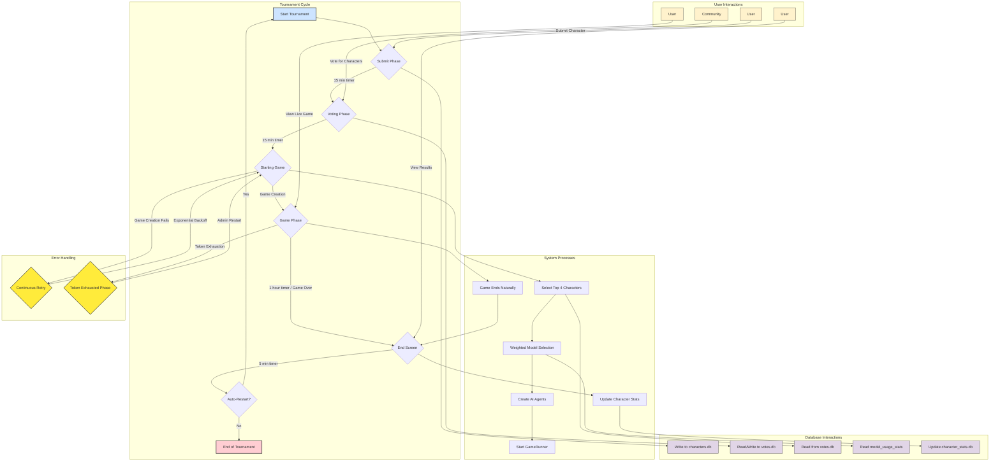

## Tournament Flow Diagram



## Complete Architecture Diagram

```mermaid
graph TD
    subgraph "Frontend & User Interaction"
        UI[Browser Interface]
        UI -- HTTP/SSE --> API[FastAPI Server]
        UI -- "HTML/CSS/JS" --> Dashboard[Live Dashboard]
        UI -- "HTML/CSS/JS" --> TournamentUI[Tournament Interface]
    end

    subgraph "Backend: FastAPI & UV"
        API -- "/api" --> RestEndpoints[REST API]
        API -- "/mcp" --> MCPServer[MCP Server]
        API -- Serves --> Dashboard
        API -- Serves --> TournamentUI
    end

    subgraph "Core Logic"
        GameManager[Game Manager]
        TournamentManager[Tournament Manager]
        GameEngine[Game Engine]
        AIAgents[AI Agents]
    end

    subgraph "AI & LLM Layer (LangChain)"
        AIAgents -- "Uses" --> PlayerConfig[Player Config]
        AIAgents -- "Uses" --> Memory[Memory Management]
        AIAgents -- "Uses" --> LLM[LLM Integration]
        LLM -- "API Calls" --> ExternalLLMs[OpenAI, Claude, etc.]
    end

    subgraph "Data Persistence (SQLite)"
        DB1[Game State DB]
        DB2[Action Tracker DB]
        DB3[Tournament DB]
        DB4[Context Summaries DB]
    end

    subgraph "Deployment (Railway)"
        Railway[Railway.app]
        Railway -- "Hosts" --> API
    end

    %% Connections
    RestEndpoints -- "Manages" --> GameManager
    MCPServer -- "Provides Tools" --> AIAgents
    GameManager -- "Creates/Manages" --> GameEngine
    GameManager -- "Interacts with" --> TournamentManager
    TournamentManager -- "Orchestrates" --> AIAgents
    TournamentManager -- "Uses" --> CharacterManager[Character Manager]
    TournamentManager -- "Uses" --> ModelManager[Model Manager]

    GameEngine -- "Persists State" --> DB1
    AIAgents -- "Log Actions" --> DB2
    TournamentManager -- "Manages Data" --> DB3
    Memory -- "Caches Summaries" --> DB4

    AIAgents -- "Are" --> RiskAgent[RiskAgent]
    RiskAgent -- "Controlled by" --> GameRunner[GameRunner]

    classDef backend fill:#cde4ff,stroke:#333,stroke-width:2px;
    classDef frontend fill:#fff2cc,stroke:#333,stroke-width:2px;
    classDef logic fill:#d5e8d4,stroke:#333,stroke-width:2px;
    classDef data fill:#e1d5e7,stroke:#333,stroke-width:2px;
    classDef deployment fill:#f8cecc,stroke:#333,stroke-width:2px;
    classDef ai fill:#dae8fc,stroke:#333,stroke-width:2px;

    class UI,Dashboard,TournamentUI frontend;
    class API,RestEndpoints,MCPServer backend;
    class GameManager,TournamentManager,GameEngine,AIAgents,CharacterManager,ModelManager,RiskAgent,GameRunner logic;
    class PlayerConfig,Memory,LLM,ExternalLLMs ai;
    class DB1,DB2,DB3,DB4 data;
    class Railway deployment;
